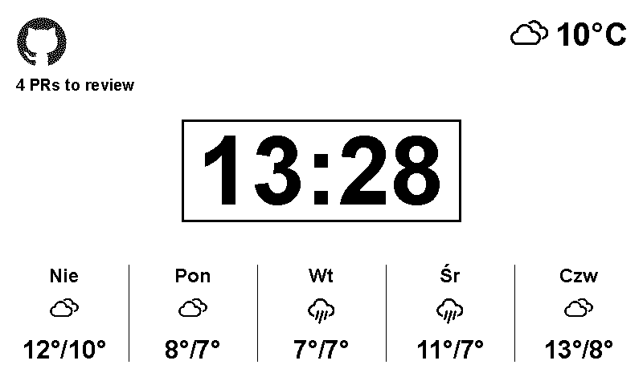

# Waveshare E-ink Info Display

A Raspberry Pi–powered information display on a Waveshare 7.5" (V2) e-paper screen. Rather than cramming everything onto one layout, it rotates through a *playlist* of screens — work (GitHub), weather, Steam — under a persistent header showing the time, date and rotation position.



I wrote a blog series about building it:

1. [Informative e-ink display with Raspberry Pi — part 1](https://maikhel.github.io/blog/informative-e-ink-display-with-raspberry-pi-part-1/) — hardware setup and drawing on the screen
2. [Part 2](https://maikhel.github.io/blog/informative-e-ink-display-with-raspberry-pi-part-2/) — rendering the clock and weather layout
3. [Part 3](https://maikhel.github.io/blog/informative-e-ink-display-with-raspberry-pi-part-3/) — fetching live data from GitHub, Steam, and OpenWeather

The posts reference specific stages of this repo — the [`1.0`](../../tree/1.0) tag matches the state described in the series.

## How it works

Two halves that only meet through JSON on disk: services fetch data on their own
schedule, the renderer draws whatever is currently in `data/`.

- `clock.py` — main loop: e-ink lifecycle, refresh policy, night mode
- `eink/` — the renderer
  - `render.py` — composes the header strip plus the active screen
  - `playlist.py` — decides which screen is showing
  - `screens/` — one module per screen, each declaring the data it needs
  - `layout.py`, `theme.py` — layout primitives and the type scale
- `services/` — fetch scripts for weather, GitHub PRs, and Steam friend statuses; each writes JSON to `data/` (run them from cron)
  - `common.py` — credentials, atomic writes, shared error handling
- `playlist.json` — which screens rotate, for how long, and when
- `demo.py` — renders to `preview.png` plus `preview_<id>.png` per screen, without the e-ink hardware, using `example_data/`
- `shutdown.py`, `deep_clean.py` — clear the panel safely / remove ghosting

Screens that have no data, or nothing worth showing, drop out of the rotation
instead of displaying an empty panel.

## Data

Each service writes one file to `data/`, wrapped in an envelope:

```json
{ "source": "github", "fetched_at": "2026-09-22T12:25:11+00:00", "data": {  } }
```

Writes go through a temporary file and a rename, so the renderer can never read
a half-written file. A fetch that fails writes nothing and leaves the previous
result in place.

Services run as rarely as suits them — weather every few hours, Steam hourly —
and old data is simply drawn as-is; `fetched_at` is logged rather than shown, so
a cron job that has quietly died is visible in `clock.log`. Only a missing or
unreadable file takes a screen out of the rotation.

## The playlist

`playlist.json` controls rotation. Each screen has a `dwell` (`"5m"`, `"90s"` or
a plain number of seconds) and an optional `when`, a list of conditions of which
any one matching is enough:

```json
{
  "id": "work",
  "dwell": "5m",
  "when": [{ "days": "weekdays", "hours": [8, 18] }]
}
```

`days` is `all`, `weekdays` or `weekends`; `hours` is `[start, end]` with `start`
inclusive and `end` exclusive. A screen with no `when` is always scheduled.
Rotation is decided only at screen changes, so the panel never reshuffles
mid-slot.

## Setup

1. Install the [Waveshare e-Paper library](https://github.com/waveshareteam/e-Paper) on the Pi, plus `pillow`, `requests`, and `python-dotenv`
2. Copy `.env.example` to `.env` and fill in your API keys and Steam IDs
3. Schedule the `services/` scripts with cron and run `clock.py` (e.g. as a systemd service)
4. Edit `playlist.json` to choose which screens rotate and when
